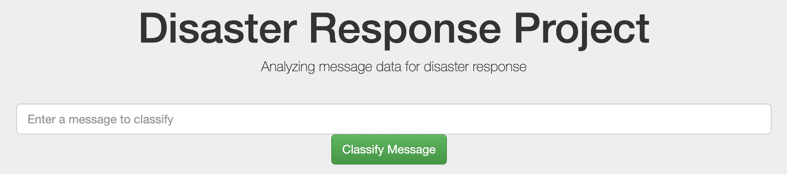
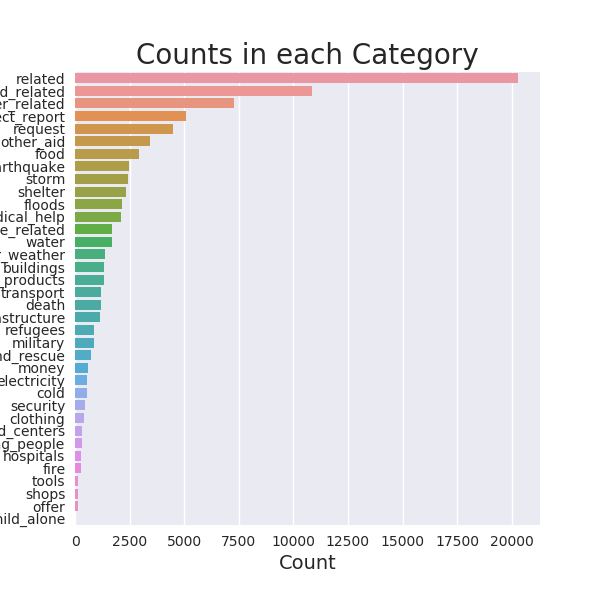
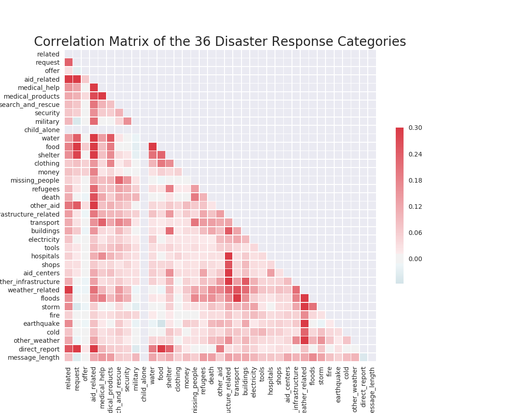
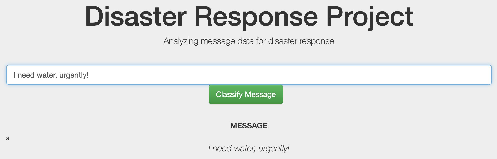
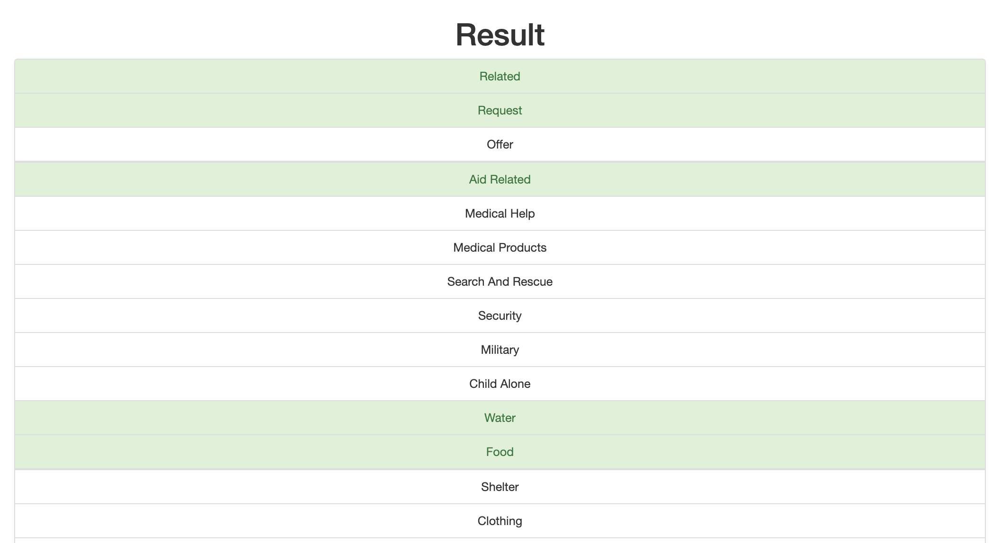

# Disaster Response Pipeline Project

## Table of Contents
1. [Introduction, Summary](#intro_summary)
2. [Installation](#installation)
3. [Project Motivation](#motivation)
4. [File Descriptions](#file_descriptions)
5. [How to Interact](#how_to)
6. [Licensing, Authors, Acknowledgments](#l_a_a)

## 1. Introduction and Summary

This Project is part of Data Science Nanodegree Program by 
Udacity. The goal of the project is to build a model for an 
API that classifies disaster messages. 

Regarding the modelling part, a Random Forest Classfier has
been implemented to make predictions. Without any hyper parameter
tuning using an additional custom transformer that generates a
new feature "message text length", the initial model
has an sufficient forecasting power with a score of 23.4 percent using
70 percent of the data for training. Even if the score ranges 
around just 23 percent, is should be considered that a prediction
could consist of more than one class. For example the message "I need
water, urgently!" falls into multiple classe and we can consider the 
model as good, if it predicts the disaster response classes water, aid-related,
related and/or food. In the modeling script is also a Randomized Grid Search included,
which iterates 150 times over a given set of hyper parameters on one percent of the 
training data. 
The best parameters given by the Randomized Search CV  of the data for training
and 10 % of the data for predicting are

Vectorizer

- ngram_range: (1,2)
- max_features: 5000
- max_df: 0.4857

Estimator (Random Forest Classifier)

- n_estimators: 50
- min_samples_split: 6
- min_samples_leaf: 1
- max_features: 'auto'

Using a randomized search in the first step, the number space for tuning parameters
in GridSearchCV can be distinctly reduced.

In the second step a GridSeachCV is used for the same set of hyperparmeters
taking under consideration a possible "ideal" number space. The best paramaters
of that model are used in the model. The models has been trained on the 10 % of the
data and evaluated on 20 % of the data.

Final model:

Vectorizer

- ngram_range: (1,2)
- max_features: 5000
- max_df: 0.75

Estimator (Random Forest Classifier)

- n_estimators: 100
- min_samples_split: 6
- min_samples_leaf: 1
- max_features: 'auto'

The final model trained on 70 % on the data has a score of 27 %. The improvement 
is around 3.6 percent.

Regarding the use of other machine learning algorithms:

The distribution of the classes is also partly very unbalanced. 
For example, the class child-alone only consists of one observation.
Hence, the model should predict all 36 classes, it is not possible to
drop this class. Unfortunately a lot of better estimators using a regression
approach or a gradient descent approach from the sklearn package, for example
Support Vector Classifier or Logistic Regression, cannot be used, because they 
break. The reason is, that those estimator need at least observations of both
binary states of a particular class, for example child-alone (0/1 = no/yes).
When splitting the predictors into training and testing sets, it cannot be garuanteed
that the training set contains the two states for the particular class child-alone.
This is a modeling problem which can be further improved.

## 2. Installations

* Python 3.x
* sys
* pandas
* numpy
* sqlite3
* sqlalchemy
* re
* time
* pickle
* nltk
* sklearn

## 3. Project Motivation

The main motivation for this project is the practical implementation
of the full workflow of a machine learning project regarding natuaral 
language processing. Within the project the focus lies on implementing 
the main step within pipelines. The project consists of three parts. 
(1) ETL-Pipeline, (2) Machine Learning Pipeline of the Natural Language Processing Part
including modeling using a Pipeline and tuning the model using Grid Search resp.
a Randomized Grid Seach.
(3) Flask App shown as a Dashboard which takes user inputs (messages), classifies them
and also shows plotly plots about the evaluation dataset.

Especially in the part (2) there is shown how to build a machine learning pipeline 
for a natural langugage processing problem. A NLP task requires in the first step 
a text processing step which consist mainly of four components: Normalization, Tokenization,
Stop Word removal, Stemming/Lemmatizing. In the second step, called feature extraction,
there is a numerical representation using the TF-IDF (term frequeny - inverse document frequency)
approach. Beyond that, additional features can be using, programming custom transformers.
For example a Text Lenght-Transformer that counts the numer of characters of a message and
uses that information as a additional feature. Finally a model will be built using a
simple and fast Random Forest Classifer that outputs results for multiple classes using 
a Multiclass-Output. 

"During and immediately after natural disaster there are millions of communication to disaster 
response organizations either direct or through social media. Disaster response organizations 
have to to filter and pull out the most important messages from this huge amount of communications 
a and redirect specific requests or indications to the proper organization that takes care of 
medical aid, water, logistics ecc. Every second is vital in this kind of situations, so handling 
the message correctly is the key" (Rigoni, 2020).

This leads to part (3) were a Flask Web App is build to classfiy a given message from a user input.
This App also shows basic plotly visualizations of the evaluation dataset, for example the distribution
of the classes or a correlation matrix for the 36 disaster response projects.

## 4. File Descriptions

"This dataset contains 30,000 messages drawn from events including an 
earthquake in Haiti in 2010, an earthquake in Chile in 2010, floods in 
Pakistan in 2010, super-storm Sandy in the U.S.A. in 2012, and news 
articles spanning a large number of years and 100s of different disasters.
The data has been encoded with 36 different categories related to disaster 
response and has been stripped of messages with sensitive information in 
their entirety. Upon release, this is the featured dataset of a new Udacity course on 
Data Science and the AI4ALL summer school and is especially utile for 
text analytics and natural language processing (NLP) tasks and models.
This dataset contains the original message in its original language, 
the English translation, and dozens of classes for message content. 
These classes are noted in column titles with a simple 
binary 1= yes, 2=no" (APPEN, n.d.).

The figure below displays the distribution of the 36 categories in the dataset.
The categories are very imbalanced. About 2 out of 3 messages are 
classified as related, while on the other hand only one message is 
classified as child alone. 

A message is often classified into multiple classes at once. Therefore
the Text-Procession-Model must be able to deliver a multi-class-output for
a given message. This is called a multiclassification problem. 

A disaster message very often
belongs to multiple classes. For example the message "I need water, urgently!"
could fall into the classes water, related, aid-related, food, all at 
the same time. This means the urge for water has the highest correlation with
the class water itself, but the word water also often occurs in the context
of food related direct report messages.

The figure below shows a correlation matrix for 
all classes in the dataset. The closer the correlation coefficient 
is to one, the higher the correlation between two classes.
A correlation coefficient of zero indicates, that two classes 
are fully independent from one another. A coefficient of minus one
indicates a very high negative independence.

## 5. How to Interact

Before the Disaster App can be opened and used, in the first step the dataset has to be
cleaned and stored in a database. In the second step a model must be trained and the 
resulting classfier has to be stored to be used by the App.

### 5.1 Instructions:
a. Run the following commands in the project's root directory to set up your database and model.

    - To run ETL pipeline that cleans data and stores in database
        `python data/process_data.py data/disaster_messages.csv data/disaster_categories.csv data/DisasterResponse.db`
    - To run ML pipeline that trains classifier and saves
        `python models/train_classifier.py data/DisasterResponse.db models/classifier.pkl`

b. Run the following command in the app's directory to run your web app.
    `python run.py`

c. Go to http://0.0.0.0:3001/

### 5.2 Using the Disaster-Application

On the main page a message has to be put in the text field. As in the figure shown below
we can write for example the message: "I need water, urgently!" After committing the 
model will predict the Disaster-Response-Classes.

The figure below illustrates the classification result. All classes are
listed among each other. If the messages falls into a specific class,
the background of this class turns green. In the case of "I need water, urgently!",
the message falls into multiple classes. The figure shows only a part of all 36
possible classes. What do you think about the classification result?

## 6. Licensing, Authors, Sources

### 6.1 Licensing

Creative Commons - Attribution 4.0 International License. URL: https://creativecommons.org/licenses/by/4.0/ 

### 6.2 Authors

Robert Friebe, June 22, 2020

### 6.3 Sources

APPEN (n.d.): Multilingual Disaster Response Messages. Resources, Open Source Datasets. 
(URL: https://appen.com/datasets/combined-disaster-response-data/)

Rigoni, S. (2020): Disaster Response Pipeline with Figure Eight. Medium Blog (February 9, 2020). 
(URL: https://medium.com/@simone.rigoni01/disaster-response-pipeline-with-figure-eight-a0addd696352)

  

